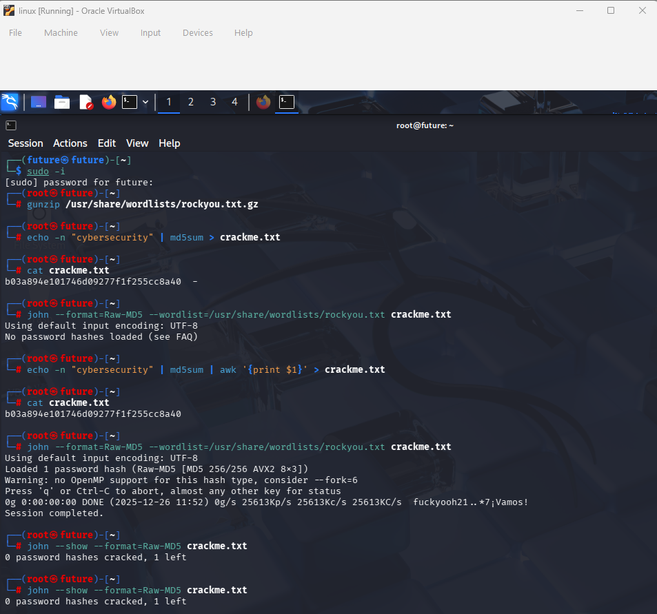
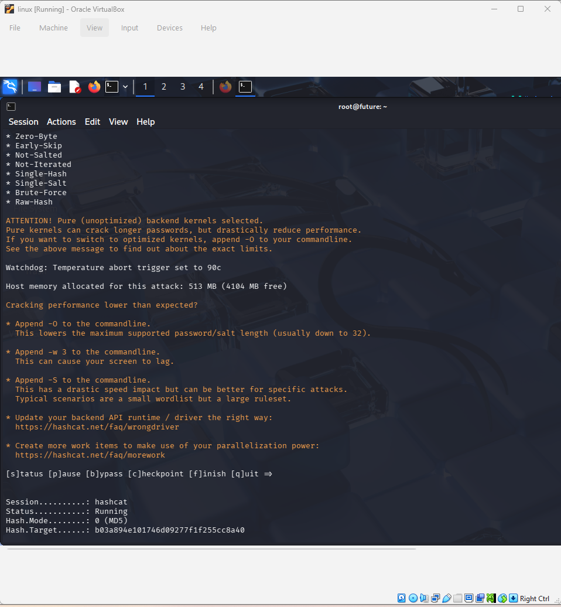
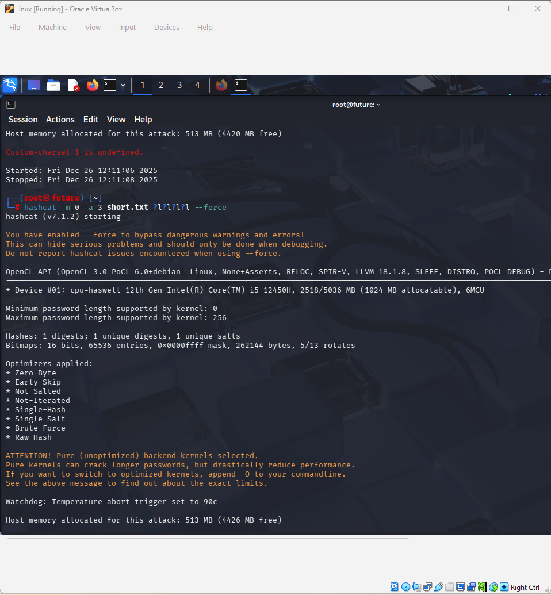
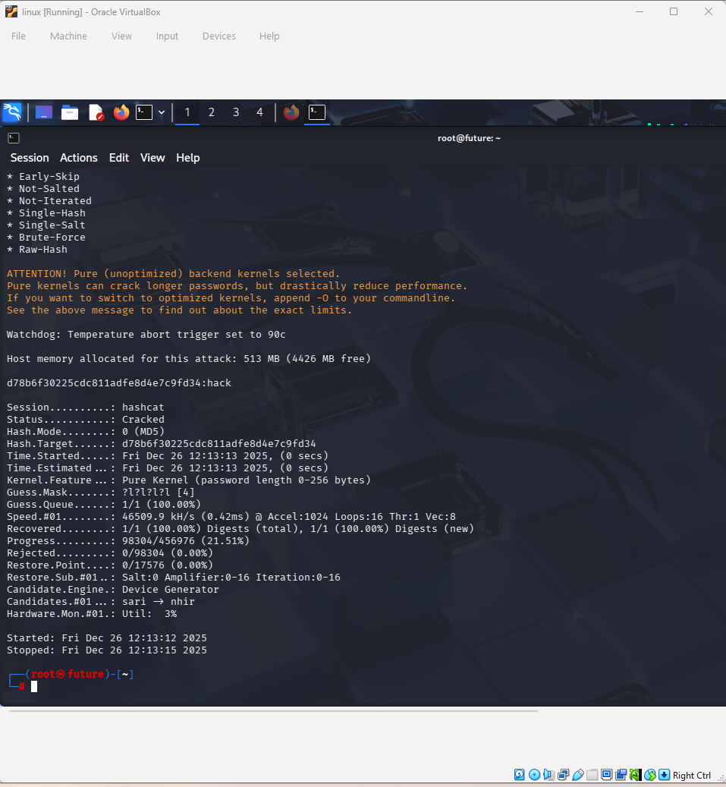

# Advanced Password Cracking & Hash Analysis 🪬🔓🔑

## Project Overview
: This lab demonstrates the practical application of password recovery techniques. I analyzed the performance differences between CPU-based dictionary attacks and hardware-accelerated brute-force (mask) attacks.

## Phase 1: Dictionary Attack (John the Ripper)
: Using the world famous 'rockyou.txt' wordlist, I performed a targeted attack on an MD5 hash.

## Phase 2: Performance & Complexity Analysis
: I utilized **Hashcat** to push my hardware (Intel i5-12450H) to it's limits. At **217.8 MH/S "Million Hashes Per Second"**, the system estimated a 12-character brute-force attack would take **13 years**, highlighting the exponential power of password length.

## Phase 3: The "Quick Win" Mask Attack
: To demonstrate a successful recovery, I executed a 4-character mask attack ('?l?l?l?l').

## Results
: The 4-character password "hack" was recovered in **under 3 seconds**.

## Conclusion 
: This project proves that short passwords offer zero protection against modern hardware. True security requires a combination of length, complexity and modern hashing algorithms like Argon2 or bcrypt.
